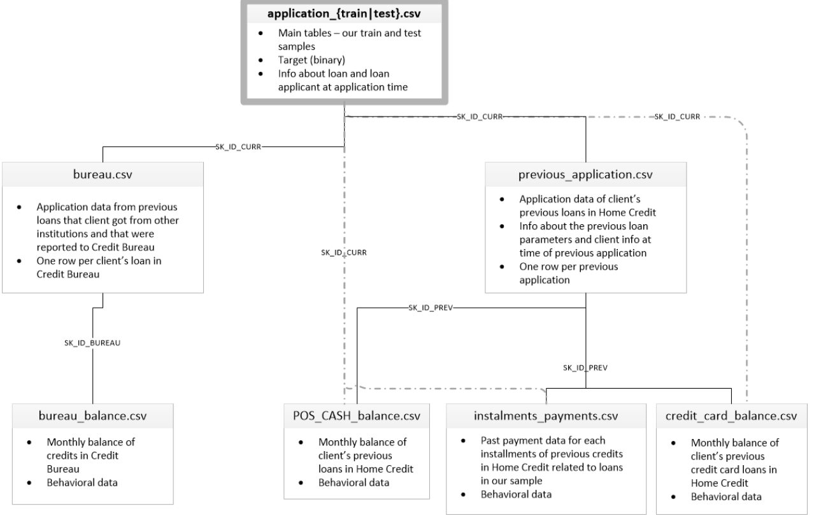
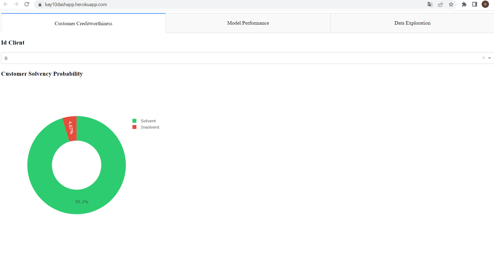
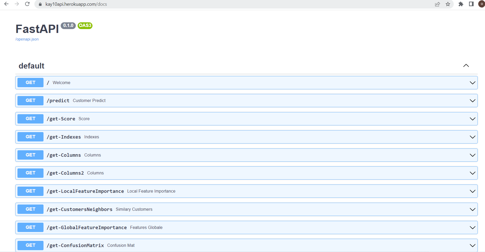

# Implement a scoring model
The financial company named "Prêt à dépenser" offers consumer credit for people with little or no loan history.
The latter wishes to implement a “credit scoring” tool relating to a classification of applications as granted or refused credit.

The objective is to develop a scoring model calculating the probability of a customer defaulting on payment to support the decision whether or not to grant a loan to a potential customer.

All .csv files are downloadable at: https://www.kaggle.com/c/home-credit-default-risk/data".

The description of the different tables is as follows:

### Modelization
The P7_Processing&Modelling.ipynb file relates to the modeling code from preprocessing to prediction:
  - Kernel choice
  - Treatment of outliers and missing values
  - Exploration of the dataset
  - Development and simulation of models
  - Choice of the best model and optimization of hyper-parameters from a business point of view
  - Analysis of global and local importance features
 
### Dashboard
The dashboard.py file relates to the code generating the dashboard which is hosted on the Heroku cloud server and accessible at this address:

https://kay10dashapp.herokuapp.com/

The files that generated it are available at: https://github.com/olivierkayyong/Dashboard
  
In the image below, we can see an overview of the site:
  

### API
The api.py and api_processing file relate to the codes used to deploy the model in the form of an API which is also hosted on the Heroku cloud server and accessible at this address:

https://kay10api.herokuapp.com/docs
The files that allowed to generate it are available at: https://github.com/olivierkayyong/Api

In the image below, we can see an overview of the site:
  

### Methodological note
The methodological note file describes:
- The model training methodology
- The business cost function, the optimization algorithm and the evaluation metric
- The global and local interpretability of the model
- Limits and possible improvements
